# Pythia ⬡ Autonomous Prediction Markets

Pythia is a fully autonomous prediction market platform powered by the **Somnia Network's Agentic L1 Architecture**.

Unlike traditional prediction markets that require centralized human oracles (like Polymarket's UMA disputes), Pythia uses Somnia's decentralized **LLM Inference Agents** and **JSON API Agents** to autonomously read news, deploy markets, and resolve outcomes on-chain with zero human intervention.

## 🚀 The Agentic Architecture

Pythia consists of three interacting layers:

1. **The Autonomous Crank (`agent.js`)**: An off-chain orchestrator that continually monitors real-world data and the blockchain state.
2. **PythiaOracle (Smart Contract)**: The on-chain gateway that interfaces with Somnia's `AgentRequester`.
3. **Somnia Decentralized Agents**: Secure, decentralized compute containers run by validators.

```mermaid
sequenceDiagram
    participant Crank as 🤖 agent.js (Off-chain)
    participant Oracle as 📜 PythiaOracle.sol
    participant Factory as 🏭 MarketFactory.sol
    participant Somnia as 🧠 Somnia Agents (L1)
    
    rect rgb(30, 30, 30)
    Note over Crank, Somnia: 1. Autonomous Market Creation
    Crank->>+Oracle: scoreEvent(newsHeadline)
    Oracle->>+Somnia: createRequest(LLM_INFERENCE_AGENT_ID)
    Somnia-->>-Oracle: handleResponse(score)
    Oracle->>Factory: createMarket() (if score > 60)
    end

    rect rgb(20, 40, 20)
    Note over Crank, Somnia: 2. Autonomous Market Resolution
    Crank->>+Oracle: requestResolution(marketAddress)
    Oracle->>+Somnia: createRequest(JSON_API_AGENT_ID)
    Somnia-->>-Oracle: handleResponse(priceData)
    Oracle->>Factory: market.resolve(outcome)
    end
```



### 1. Autonomous Market Creation
The off-chain crank (`agent.js`) fetches real-world crypto news and pushes the headlines to `PythiaOracle` via `scoreEvent()`. The smart contract uses the **LLM Inference Agent** (`12847293847561029384`) to analyze the news sentiment. If the LLM determines the news is highly impactful (score > 60), the oracle autonomously deploys a new prediction market.

### 2. Trustless Resolution
When a market's deadline expires, the crank invokes `requestResolution()`. The smart contract triggers the **JSON API Agent** (`13174292974160097713`) which reaches out to public APIs (e.g., CoinGecko) in a decentralized container. The agent returns the data to the oracle via a callback, and the smart contract trustlessly resolves the market. No human validators needed.

## 💻 Tech Stack
- **Smart Contracts**: Solidity, Foundry/Hardhat
- **Agent Integration**: Somnia Agentic L1 (`createRequest`, `handleResponse`)
- **Frontend**: Next.js, React, Framer Motion, Wagmi, RainbowKit
- **Automation**: Node.js (`agent.js`)

## 🛠 Setup & Run

### 1. Smart Contracts
```bash
cd contracts
forge build
forge script script/Deploy.s.sol --rpc-url https://dream-rpc.somnia.network --broadcast
```

### 2. Frontend
```bash
cd frontend
npm install
npm run dev
```

### 3. Start the Autonomous Agent
Ensure you have your `.env` configured with your wallet's `PRIVATE_KEY` funded with STT for agent deposits.
```bash
node scripts/agent.js
```
*The agent will run indefinitely, scanning news, creating markets, and resolving expired ones.*

## 🏆 Hackathon Goals
- [x] Prove on-chain LLM sentiment analysis can dictate protocol logic.
- [x] Prove off-chain data can be autonomously ingested and verified via JSON API Agents.
- [x] Create a sleek, premium UI demonstrating the future of Agent-Driven DeFi.
